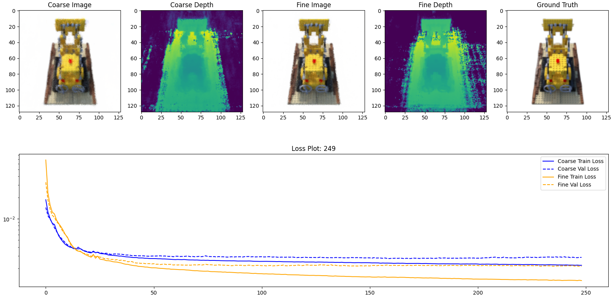
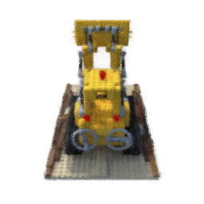
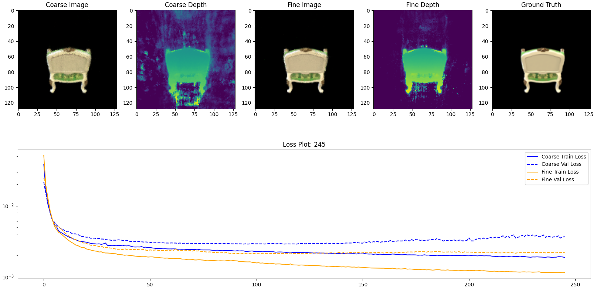
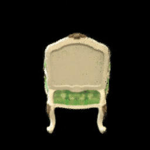

# NeRF TensorFlow v2 Keras Re-Implementation
[Work in Progress]

Author: Naufal Suryanto

## Quickstart
### 1. Prepare dataset
- Download the `nerf_synthetic` dataset from NeRF Official [[Here]](https://drive.google.com/file/d/18JxhpWD-4ZmuFKLzKlAw-w5PpzZxXOcG/view)
- Extract the dataset to `data` folder. The recommended structure is `data/nerf_synthetic/[object_name]`

### 2. Install the dependencies
- Make sure that you have install all dependencies 
- To install the dependencies, you can run `python3 -m pip install -r requirements.txt`

### 3. Run the tests [optional]
- Run the tests to make sure that all functions can be run as expected `python3 -m pytest .`

### 4. Run the training code
- Single GPU: If you only have a single gpu, run the training code `train_single.py`
- Multiple GPUs: If you only have multiple gpu, run the training code `train.py`. The batch size will be multiplied by number of GPU instances
- Examples: 
    - `python3 train.py --data_dir data/nerf_synthetic/lego --img_wh 128 --batch_size 2 --name lego_128 --ray_chunks 2048 --white_bg`
    - `python3 train_single.py  --data_dir data/nerf_synthetic/chair --img_wh 128 --eagerly --name chair_128 --ray_chunks 4096`
- By default, the logs and trained model can be seen on `logs` and `models` directories, respectively
### 5. Run the inference code
- After complete training the model, we can run the inference code to generate 360 degrees rotation of the model
- Run the inference code, for example: `python3 inference.py --model_dirs model/lego_128 --img_wh 256 --name lego_128_256`
- By default, the output gif can be seen on `output` directory
## Results

|                           Training Logs                         |                         Inference                       |
| :-------------------------------------------------------------: | :-----------------------------------------------------: |
|    |       |
|  |  |

## Implementation and Features

### NeRF Model
- [x] Positional Encoding
- [x] Coarse and Fine Model with Hierarchical Sampling

### Training Supports
- [x] Single or multiple GPU training
- [x] Split the MLP prediction into chunks for fitting GPU memory (tune `--ray_chunks` argument to fit your memory; should be a factors of image_height * image_width * batch_size)
- [x] [Default] Use **graph** execution with tf.function for **better performance** (but may take longer initialization and larger memory usage)
- [x] [Optional] Use **eager** execution for **faster initialization and lower memory usage** (include `--eagerly` option when run the code, but currenly only works on single GPU training)
- [x] Black or White Background (include `--white_bg` option when run the code for better result)
- [x] Log the training history in CSV, plot image, and sample image
- [x] Continue model training from last logging step

## References
### Code Implementation Inspired by
- Official Keras Code Example for NeRF: [[Link]](https://keras.io/examples/vision/nerf)
- Awesome NeRF PyTorch Implementation: [[Link]](https://github.com/kakaobrain/NeRF-Factory)
- NeRF Implementation Tutorial by PyImageSearch: [[Part-1]](https://pyimagesearch.com/2021/11/10/computer-graphics-and-deep-learning-with-nerf-using-tensorflow-and-keras-part-1/) [[Part-2]](https://pyimagesearch.com/2021/11/17/computer-graphics-and-deep-learning-with-nerf-using-tensorflow-and-keras-part-2/) [[Part-3]](https://pyimagesearch.com/2021/11/24/*computer-graphics-and-deep-learning-with-nerf-using-tensorflow-and-keras-part-3/)

### Original Project Page
- NeRF: [[Project Page]](https://www.matthewtancik.com/nerf) [[Paper]](https://arxiv.org/abs/2003.08934) [[Code]](https://github.com/bmild/nerf)